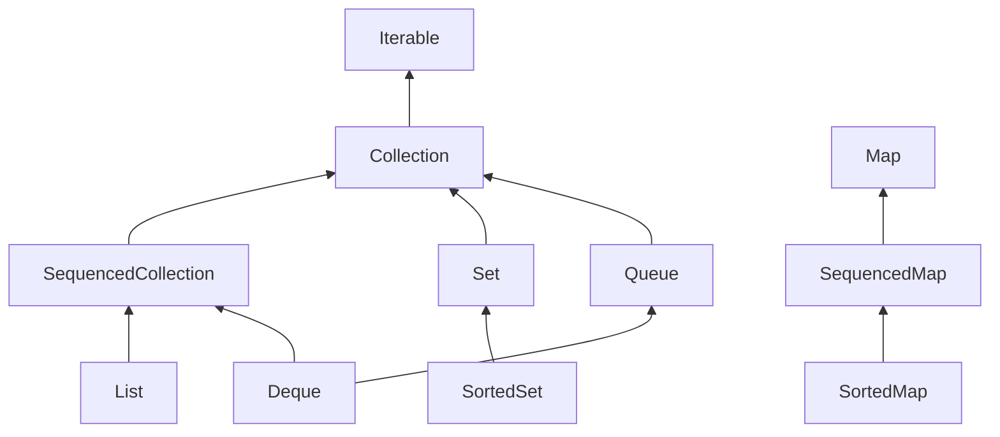
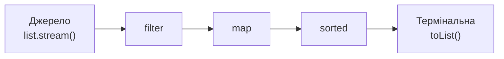

# Узагальнення, колекції та Stream API
### Generics · Collections Framework · Streams у Java

note: Java 27. Усі приклади — стабільні фічі, preview позначено окремо. Детальний конспект — в окремому файлі.

---

## План

1. Generics: навіщо, синтаксис, обмеження <!-- element class="fragment" -->
2. Інваріантність, wildcards і PECS <!-- element class="fragment" -->
3. Стирання типів і його наслідки <!-- element class="fragment" -->
4. Collections Framework: архітектура і складність операцій <!-- element class="fragment" -->
5. Хешування: `equals`/`hashCode`, колізії, будова `HashMap` <!-- element class="fragment" -->
6. Ітератори <!-- element class="fragment" -->
7. Лямбди, Stream API, ліниве виконання <!-- element class="fragment" -->
8. Практика <!-- element class="fragment" -->

---

## Хронологія

| Версія | Що з'явилось |
|---|---|
| Java 1.2 | Collections Framework |
| **Java 5** | Generics, for-each, autoboxing |
| **Java 8** | Лямбди, Stream API, `Optional` |
| Java 9 | `List.of`, `Set.of`, `Map.of` |
| Java 16 | `Stream.toList()`, `mapMulti` |
| **Java 21** | Sequenced Collections |
| **Java 24** | Stream Gatherers |
| Java 28 | Value classes — preview (Valhalla) |

---

# Частина 1
## Generics

---

## Як було до Java 5

```java
List names = new ArrayList();
names.add("Anna");
names.add(42);                      // компілятор мовчить

String first = (String) names.get(0);
String second = (String) names.get(1); // 💥 ClassCastException
```

- Колекція зберігає `Object` — туди можна покласти **що завгодно** <!-- element class="fragment" -->
- Кожне читання — ручне приведення типу <!-- element class="fragment" -->
- Помилка виявляється **в рантаймі**, часто далеко від місця, де її зробили <!-- element class="fragment" -->

---

## З generics

```java
List<String> names = new ArrayList<>();
names.add("Anna");
names.add(42);                 // ❌ помилка компіляції

String first = names.get(0);   // приведення не потрібне
```

**Generics** — параметризація типів: алгоритм або структура даних пишеться **один раз** і працює з будь-яким типом, зберігаючи перевірку типів компілятором.

---

## Узагальнений клас

```java
public class Box<T> {
    private T value;

    public Box(T value) { this.value = value; }

    public T get() { return value; }

    public <R> Box<R> map(Function<T, R> f) {
        return new Box<>(f.apply(value));
    }
}

Box<String> b = new Box<>("hello");       // diamond <>
Box<Integer> len = b.map(String::length); // Box<Integer>
var auto = new Box<>(3.14);               // Box<Double>
```

Угода про імена: `T` — type, `E` — element, `K`/`V` — key/value, `R` — result.

---

## Узагальнений метод та інтерфейс

```java
// Метод оголошує власний параметр типу перед типом результату
static <T> T firstOrDefault(List<T> list, T fallback) {
    return list.isEmpty() ? fallback : list.getFirst();
}

String s = firstOrDefault(List.of("a", "b"), "-"); // T = String (виведено)

// Узагальнений інтерфейс
interface Repository<T, ID> {
    Optional<T> findById(ID id);
    List<T> findAll();
    void save(T entity);
}

class UserRepository implements Repository<User, Long> { ... }
```

---

## Обмеження типів: `extends`

```java
// Не скомпілюється: у T може не бути compareTo
static <T> T max(List<T> list) { ... a.compareTo(b) ... }  // ❌

// Обмежуємо: T має вміти порівнюватися з T
static <T extends Comparable<T>> T max(List<T> list) {
    T best = list.getFirst();
    for (T item : list) {
        if (item.compareTo(best) > 0) best = item;
    }
    return best;
}

max(List.of(3, 7, 1));        // 7
max(List.of("b", "a"));       // "b"
max(List.of(new Object()));   // ❌ Object не Comparable
```

<!-- element class="fragment" -->
Кілька обмежень: `<T extends Number & Comparable<T>>` — спершу клас, потім інтерфейси.

---

## Інваріантність

```java
Integer i = 5;
Number n = i;                        // ✅ Integer — підтип Number

List<Integer> ints = new ArrayList<>();
List<Number> nums = ints;            // ❌ помилка компіляції!
```

Чому? Бо тоді можна було б зробити так:
<!-- element class="fragment" -->

```java
nums.add(3.14);                      // Double у список Integer-ів
Integer x = ints.get(0);             // 💥
```
<!-- element class="fragment" -->

<!-- element class="fragment" -->
> `List<Integer>` **не є** підтипом `List<Number>`. Generics у Java **інваріантні**.

---

## А масиви — коваріантні

```java
Integer[] ints = new Integer[3];
Object[] objs = ints;        // ✅ компілюється
objs[0] = "text";            // 💥 ArrayStoreException у рантаймі
```

- Масиви знають свій тип у рантаймі і перевіряють кожен запис <!-- element class="fragment" -->
- Generics перенесли цю перевірку на етап компіляції <!-- element class="fragment" -->
- Звідси порада: **віддавайте перевагу `List<T>` над `T[]`** <!-- element class="fragment" -->

note: Коваріантність масивів — історичне рішення Java 1.0, коли generics ще не було, а методи на кшталт Arrays.sort(Object[]) мусили якось працювати з будь-якими масивами.

---

## Wildcards: `? extends`

```java
static double sum(List<? extends Number> list) {
    double total = 0;
    for (Number n : list) total += n.doubleValue(); // ✅ читати як Number
    return total;
}

sum(List.of(1, 2, 3));       // List<Integer> ✅
sum(List.of(1.5, 2.5));      // List<Double>  ✅

list.add(42);                // ❌ всередині sum — не можна
```

`? extends Number` — "список **якогось** підтипу Number".
Читати можна (це точно `Number`), записувати — ні (невідомо, якого саме підтипу).

---

## Wildcards: `? super`

```java
static void fillWithInts(List<? super Integer> list) {
    for (int i = 0; i < 3; i++) list.add(i);   // ✅ записувати Integer
    Object o = list.get(0);                    // читати — лише як Object
}

fillWithInts(new ArrayList<Integer>());  // ✅
fillWithInts(new ArrayList<Number>());   // ✅
fillWithInts(new ArrayList<Object>());   // ✅
```

`? super Integer` — "список, у який **точно можна покласти** Integer".

---

## PECS

> **P**roducer **E**xtends, **C**onsumer **S**uper

```java
// Із src ми ЧИТАЄМО (producer), у dest ми ПИШЕМО (consumer)
public static <T> void copy(List<? super T> dest, List<? extends T> src)
```

```java
List<Integer> ints = List.of(1, 2, 3);
List<Number> nums = new ArrayList<>(List.of(0, 0, 0));
Collections.copy(nums, ints);   // T = Integer
```

| Структура… | Wildcard |
|---|---|
| лише віддає `T` | `? extends T` |
| лише приймає `T` | `? super T` |
| і те, і те | просто `T` |
| тип неважливий | `?` |

note: Реальний приклад з JDK — Collections.max: <T extends Object & Comparable<? super T>> T max(Collection<? extends T> coll). Страшно, але кожна частина має сенс: ? super T дозволяє порівнювати, наприклад, LocalDate, який реалізує Comparable<ChronoLocalDate>.

---

## Стирання типів (Type Erasure)

Після компіляції **параметрів типу немає**:

```java
// Ви пишете                        // У байткоді
class Box<T> {                      class Box {
    T value;                            Object value;
    T get() { return value; }           Object get() { return value; }
}                                   }

String s = box.get();               String s = (String) box.get();
```

- `T` замінюється на свою межу (`Object` або те, що після `extends`) <!-- element class="fragment" -->
- Компілятор вставляє приведення в місцях використання <!-- element class="fragment" -->
- Для коректного перевизначення генеруються **bridge-методи** <!-- element class="fragment" -->

note: Навіщо так? Сумісність: код Java 5 з generics мав працювати з бібліотеками і JVM, написаними до Java 5, без змін у байткоді. Для порівняння: у .NET List<int> і List<string> — різні типи в рантаймі (reified generics).

---

## Наслідки стирання

```java
class Box<T> {
    T create()      { return new T(); }          // ❌ тип невідомий
    T[] array()     { return new T[10]; }        // ❌
    static T shared;                             // ❌ static один на всі Box<…>
}

obj instanceof List<String>                      // ❌ для Object
List<int> nums;                                  // ❌ лише посилальні типи

void print(List<String> l)  { }
void print(List<Integer> l) { }                  // ❌ однакове стирання

new ArrayList<String>().getClass() == new ArrayList<Integer>().getClass(); // true
```

---

## Як обійти

```java
// 1. Передати "токен" класу
static <T> T create(Class<T> type) throws ReflectiveOperationException {
    return type.getDeclaredConstructor().newInstance();
}

// 2. Передати фабрику — краще, без рефлексії
static <T> List<T> fill(int n, Supplier<T> factory) {
    List<T> list = new ArrayList<>();
    for (int i = 0; i < n; i++) list.add(factory.get());
    return list;
}

List<StringBuilder> sbs = fill(3, StringBuilder::new);
```

---

## Майбутнє: Valhalla

- Зараз `List<Integer>` — це масив **посилань** на окремі об'єкти в купі <!-- element class="fragment" -->
- JEP 401 (Java 28, preview): **value classes** — об'єкти без ідентичності, які JVM може зберігати "пласко" <!-- element class="fragment" -->
- Далі в планах — generics над примітивами та спеціалізація (JEP 218) <!-- element class="fragment" -->

<!-- element class="fragment" -->
> Не частина сьогоднішнього матеріалу для практики, але пояснює, **чому** `List<int>` досі неможливий і що з цим роблять.

---

# Частина 2
## Collections Framework

---

## Архітектура



- Інтерфейси описують **поведінку**, класи — **реалізацію** <!-- element class="fragment" -->
- `Map` — окрема гілка, це **не** `Collection` <!-- element class="fragment" -->
- Пишіть код через інтерфейс: `List<String> x = new ArrayList<>()` <!-- element class="fragment" -->

---

## Основні реалізації

| Інтерфейс | Реалізації |
|---|---|
| `List` | `ArrayList`, `LinkedList` |
| `Deque` / `Queue` | `ArrayDeque`, `LinkedList`, `PriorityQueue` |
| `Set` | `HashSet`, `LinkedHashSet`, `TreeSet` |
| `Map` | `HashMap`, `LinkedHashMap`, `TreeMap` |

<!-- element class="fragment" -->
Застарілі, не використовуйте в новому коді: `Vector`, `Stack`, `Hashtable`.

---

## `ArrayList` — динамічний масив

```text
 size = 5, capacity = 8
┌───┬───┬───┬───┬───┬───┬───┬───┐
│ A │ B │ C │ D │ E │   │   │   │
└───┴───┴───┴───┴───┴───┴───┴───┘
```

- `get(i)` — **O(1)**: адреса = початок + i × розмір комірки <!-- element class="fragment" -->
- `add(x)` у кінець — **амортизовано O(1)**: коли місце закінчилось, масив росте в ~1.5 раза з копіюванням <!-- element class="fragment" -->
- `add(0, x)` / `remove(0)` — **O(n)**: треба зсунути всі елементи <!-- element class="fragment" -->
- Елементи лежать поруч у пам'яті → добре працює кеш процесора <!-- element class="fragment" -->

---

## `LinkedList` — двозв'язний список

```text
null ← [A] ⇄ [B] ⇄ [C] ⇄ [D] → null
       head             tail
```

- Вставка / видалення на кінцях — **O(1)** <!-- element class="fragment" -->
- `get(i)` — **O(n)**: треба пройти вузлами <!-- element class="fragment" -->
- Вставка в середину — O(1) **лише** якщо ми вже там (через `ListIterator`) <!-- element class="fragment" -->
- Кожен вузол — окремий об'єкт: +2 посилання, розкид у пам'яті <!-- element class="fragment" -->

<!-- element class="fragment" -->
> На практиці `LinkedList` майже завжди програє `ArrayList` і `ArrayDeque`.

---

## `ArrayDeque` — кільцевий буфер

```text
          tail       head
           ↓          ↓
┌───┬───┬───┬───┬───┬───┬───┬───┐
│ C │ D │   │   │   │ A │ B │   │   ← елементи "загортаються"
└───┴───┴───┴───┴───┴───┴───┴───┘
```

```java
Deque<Integer> stack = new ArrayDeque<>();
stack.push(1); stack.push(2);
stack.pop();                    // 2 — LIFO

Deque<Integer> queue = new ArrayDeque<>();
queue.offer(1); queue.offer(2);
queue.poll();                   // 1 — FIFO
```

Найкращий вибір і для **стека**, і для **черги**. Не допускає `null`.

---

## Порівняння послідовних колекцій

| Операція | `ArrayList` | `LinkedList` | `ArrayDeque` |
|---|---|---|---|
| `get(i)` | **O(1)** | O(n) | — |
| додати в кінець | O(1)* | O(1) | O(1)* |
| додати на початок | O(n) | O(1) | O(1)* |
| видалити з початку | O(n) | O(1) | O(1) |
| вставка в середину | O(n) | O(n)** | — |
| `contains` | O(n) | O(n) | O(n) |
| пам'ять на елемент | мала | велика | мала |

\* амортизовано  \*\* O(1), якщо позицію вже знайдено ітератором

---

## Sequenced Collections (Java 21)

```java
List<String> list = new ArrayList<>(List.of("a", "b", "c"));
list.getFirst();        // "a"  — замість list.get(0)
list.getLast();         // "c"  — замість list.get(list.size() - 1)
list.addFirst("z");
list.reversed();        // [c, b, a, z] — представлення, не копія

LinkedHashMap<String, Integer> map = new LinkedHashMap<>();
map.put("x", 1); map.put("y", 2);
map.firstEntry();       // x=1
map.pollLastEntry();    // y=2, видаляє
```

Єдиний API для "першого" та "останнього" у `List`, `Deque`, `LinkedHashSet`, `SortedSet`, `LinkedHashMap`, `SortedMap`.

---

## Незмінні колекції

```java
List<String> a = List.of("x", "y");        // незмінна
a.add("z");                                 // 💥 UnsupportedOperationException

List<String> src = new ArrayList<>(List.of("x"));
List<String> view = Collections.unmodifiableList(src); // лише обгортка
List<String> copy = List.copyOf(src);                  // справжня копія
src.add("y");
view;   // [x, y] — бачить зміни!
copy;   // [x]
```

- `List.of` / `Set.of` / `Map.of` не допускають `null` <!-- element class="fragment" -->
- `Set.of` / `Map.of` не гарантують порядок <!-- element class="fragment" -->

---

# Частина 3
## Set, Map і хешування

---

## Як влаштований `HashMap`

```text
table (capacity = 16)
 [0] → null
 [1] → ("cat", 3) → ("act", 7)       ← колізія: ланцюжок
 [2] → null
 [3] → ("dog", 5)
 ...
[15] → null
```

1. `h = key.hashCode()` <!-- element class="fragment" -->
2. Перемішування: `h ^ (h >>> 16)` <!-- element class="fragment" -->
3. Індекс кошика: `h & (capacity - 1)` <!-- element class="fragment" -->
4. У кошику шукаємо ключ через `equals` <!-- element class="fragment" -->

note: capacity — завжди степінь двійки, тому & замінює дорогий %. Перемішування старших бітів потрібне, бо при малій таблиці індекс залежить лише від молодших бітів hashCode.

---

## Колізії і ріст таблиці

- **Колізія** — різні ключі потрапили в один кошик <!-- element class="fragment" -->
- Кошик — зв'язний список; якщо в ньому > 8 елементів (і таблиця ≥ 64) — стає **червоно-чорним деревом**: O(n) → O(log n) <!-- element class="fragment" -->
- **Load factor** 0.75: коли елементів > 75 % від capacity — таблиця подвоюється, всі елементи перерозподіляються <!-- element class="fragment" -->
- Знаєте розмір наперед — `HashMap.newHashMap(1000)` (Java 19+) <!-- element class="fragment" -->

<!-- element class="fragment" -->
> Середній випадок `get`/`put` — **O(1)**. Але лише за **хорошого** `hashCode`.

---

## Контракт `equals` / `hashCode`

**`equals`** має бути:
- рефлексивним: `a.equals(a)` <!-- element class="fragment" -->
- симетричним: `a.equals(b)` ⇔ `b.equals(a)` <!-- element class="fragment" -->
- транзитивним, узгодженим, `a.equals(null) == false` <!-- element class="fragment" -->

**`hashCode`**:
- `a.equals(b)` ⇒ `a.hashCode() == b.hashCode()` <!-- element class="fragment" -->
- але **не навпаки**: однаковий хеш ≠ рівні об'єкти <!-- element class="fragment" -->
- не змінюється, поки не змінюються поля, що беруть участь в `equals` <!-- element class="fragment" -->

---

## Що буде, якщо порушити

```java
class Point {
    final int x, y;
    Point(int x, int y) { this.x = x; this.y = y; }

    @Override public boolean equals(Object o) {
        return o instanceof Point p && x == p.x && y == p.y;
    }
    // hashCode не перевизначено!
}

Set<Point> set = new HashSet<>();
set.add(new Point(1, 2));
set.contains(new Point(1, 2));   // false 🤯
```

<!-- element class="fragment" -->
Різні `hashCode` (від `Object`) → різні кошики → `equals` навіть не викликається.

---

## Правильно

```java
@Override public int hashCode() {
    return Objects.hash(x, y);      // або 31 * x + y
}
```

Ще краще — `record`:
<!-- element class="fragment" -->

```java
record Point(int x, int y) {}       // equals + hashCode згенеровано
```
<!-- element class="fragment" -->

<!-- element class="fragment" -->
Погано: `return 42;` — контракт формально виконано, але **всі** ключі в одному кошику → O(n) або O(log n) замість O(1).

---

## Змінний ключ — пастка

```java
class User {
    String name;
    // equals і hashCode по name
}

Map<User, String> roles = new HashMap<>();
User u = new User("anna");
roles.put(u, "admin");

u.name = "bob";             // хеш змінився!
roles.get(u);               // null
roles.containsKey(u);       // false, хоча об'єкт "там"
```

<!-- element class="fragment" -->
> Ключі `HashMap` та елементи `HashSet` мають бути **незмінними** (або хоча б не змінювати поля з `equals`/`hashCode`).

---

## Три види `Map` (і `Set`)

| | `HashMap` | `LinkedHashMap` | `TreeMap` |
|---|---|---|---|
| Структура | хеш-таблиця | хеш-таблиця + список | червоно-чорне дерево |
| `get`/`put` | O(1) | O(1) | O(log n) |
| Порядок | немає | вставки / доступу | відсортований |
| Вимога до ключа | `equals` + `hashCode` | те саме | `Comparable` або `Comparator` |

`HashSet`, `LinkedHashSet`, `TreeSet` — це відповідні `Map` без значень.

---

## `TreeMap` — навігація

```java
TreeMap<Integer, String> grades = new TreeMap<>(Map.of(
    60, "E", 67, "D", 75, "C", 82, "B", 90, "A"));

grades.floorEntry(78);        // 75=C — найбільший ключ ≤ 78
grades.ceilingKey(83);        // 90
grades.headMap(75);           // {60=E, 67=D}
grades.descendingMap();       // від A до E
```

Ідеально для діапазонів, розкладів, шкал оцінювання.

---

## Корисні методи `Map`

```java
Map<String, Integer> freq = new HashMap<>();
for (String w : words) {
    freq.merge(w, 1, Integer::sum);          // лічильник в один рядок
}

Map<String, List<String>> groups = new HashMap<>();
groups.computeIfAbsent("A", k -> new ArrayList<>()).add("Anna");

freq.getOrDefault("xyz", 0);
freq.putIfAbsent("new", 0);

for (var e : freq.entrySet()) {
    IO.println(e.getKey() + " → " + e.getValue());
}
```

---

# Частина 4
## Ітератори

---

## `Iterator` — єдиний спосіб обходу

```java
public interface Iterator<E> {
    boolean hasNext();
    E next();
    default void remove() { throw new UnsupportedOperationException(); }
}
```

```java
for (String s : list) { ... }
// компілятор перетворює на:
for (Iterator<String> it = list.iterator(); it.hasNext(); ) {
    String s = it.next();
    ...
}
```

Будь-що, що реалізує `Iterable<T>`, працює з for-each.

---

## `ConcurrentModificationException`

```java
List<Integer> nums = new ArrayList<>(List.of(1, 2, 3, 4));
for (Integer n : nums) {
    if (n % 2 == 0) nums.remove(n);    // 💥 ConcurrentModificationException
}
```

Ітератор **fail-fast**: помічає, що колекцію змінили в обхід нього.
<!-- element class="fragment" -->

```java
Iterator<Integer> it = nums.iterator();
while (it.hasNext()) {
    if (it.next() % 2 == 0) it.remove();   // ✅ через ітератор
}

nums.removeIf(n -> n % 2 == 0);            // ✅ ще простіше
```
<!-- element class="fragment" -->

---

## Власний `Iterable`

```java
record Range(int from, int to, int step) implements Iterable<Integer> {
    @Override
    public Iterator<Integer> iterator() {
        return new Iterator<>() {
            private int current = from;
            public boolean hasNext() { return current < to; }
            public Integer next() {
                if (!hasNext()) throw new NoSuchElementException();
                int value = current;
                current += step;
                return value;
            }
        };
    }
}

for (int i : new Range(0, 10, 3)) IO.println(i);   // 0 3 6 9
```

Ітератор ховає, **як** зберігаються дані, і дає лише **послідовний доступ**.

---

# Частина 5
## Лямбди та Stream API

---

## Лямбда-вирази

```java
Comparator<String> byLength = (a, b) -> Integer.compare(a.length(), b.length());

Runnable hello = () -> IO.println("Hi");

Function<Integer, Integer> square = x -> x * x;

BinaryOperator<Integer> add = (a, b) -> {
    int result = a + b;
    return result;
};
```

- Лямбда — реалізація **функціонального інтерфейсу** (один абстрактний метод) <!-- element class="fragment" -->
- Тип параметрів виводиться з контексту <!-- element class="fragment" -->
- Захоплювати можна лише **effectively final** змінні <!-- element class="fragment" -->

---

## Стандартні функціональні інтерфейси

| Інтерфейс | Сигнатура | Приклад |
|---|---|---|
| `Supplier<T>` | `() → T` | `() -> new ArrayList<>()` |
| `Consumer<T>` | `T → void` | `s -> IO.println(s)` |
| `Function<T, R>` | `T → R` | `s -> s.length()` |
| `Predicate<T>` | `T → boolean` | `s -> s.isEmpty()` |
| `UnaryOperator<T>` | `T → T` | `s -> s.trim()` |
| `BinaryOperator<T>` | `(T, T) → T` | `(a, b) -> a + b` |

Плюс `Bi…`-версії для двох аргументів і `Int…`/`Long…`/`Double…` для примітивів.

---

## Посилання на методи

| Вид | Запис | Еквівалентна лямбда |
|---|---|---|
| Статичний | `Integer::parseInt` | `s -> Integer.parseInt(s)` |
| Метод конкретного об'єкта | `prefix::concat` | `s -> prefix.concat(s)` |
| Метод довільного об'єкта | `String::length` | `s -> s.length()` |
| Конструктор | `ArrayList::new` | `() -> new ArrayList<>()` |

---

## Імперативно vs декларативно

```java
// Імперативно: ЯК зробити
List<String> result = new ArrayList<>();
for (Student s : students) {
    if (s.grade() >= 90) {
        result.add(s.name().toUpperCase());
    }
}
Collections.sort(result);
```

```java
// Декларативно: ЩО отримати
List<String> result = students.stream()
    .filter(s -> s.grade() >= 90)
    .map(s -> s.name().toUpperCase())
    .sorted()
    .toList();
```
<!-- element class="fragment" -->

---

## Конвеєр (pipeline)



- **Джерело**: колекція, масив, `Stream.of`, `IntStream.range`, файл… <!-- element class="fragment" -->
- **Проміжні** операції повертають новий `Stream` — їх можна ланцюжити <!-- element class="fragment" -->
- **Термінальна** операція запускає обчислення і повертає результат <!-- element class="fragment" -->
- Stream **не зберігає** дані і **не змінює** джерело <!-- element class="fragment" -->

---

## Проміжні операції

| Операція | Що робить |
|---|---|
| `filter(p)` | лишає елементи, для яких `p` — `true` |
| `map(f)` | перетворює кожен елемент |
| `flatMap(f)` | кожен елемент → потік, результати "склеюються" |
| `distinct()` | прибирає дублікати (через `equals`) |
| `sorted()` / `sorted(cmp)` | сортує |
| `limit(n)` / `skip(n)` | перші n / пропустити n |
| `takeWhile(p)` / `dropWhile(p)` | поки умова виконується |
| `peek(action)` | підглянути (для налагодження) |

---

## `map` vs `flatMap`

```java
List<List<String>> courses = List.of(
    List.of("Java", "SQL"),
    List.of("Java", "Python"));

courses.stream().map(List::size).toList();
// [2, 2]

courses.stream().flatMap(List::stream).distinct().toList();
// [Java, SQL, Python]
```

`map`: один → один. `flatMap`: один → **скільки завгодно** (0, 1, n).

---

## Термінальні операції

| Операція | Результат |
|---|---|
| `toList()` | незмінний `List` |
| `collect(collector)` | будь-яка структура |
| `forEach(action)` | нічого, побічний ефект |
| `count()` | `long` |
| `min(cmp)` / `max(cmp)` | `Optional<T>` |
| `reduce(...)` | згортка в одне значення |
| `anyMatch` / `allMatch` / `noneMatch` | `boolean` |
| `findFirst()` / `findAny()` | `Optional<T>` |

---

## `reduce` — згортка

```java
int sum = Stream.of(1, 2, 3, 4)
    .reduce(0, (acc, x) -> acc + x);   // ((((0+1)+2)+3)+4) = 10

Optional<String> longest = Stream.of("a", "abc", "ab")
    .reduce((a, b) -> a.length() >= b.length() ? a : b);   // "abc"
```

```text
acc=0  x=1 → 1
acc=1  x=2 → 3
acc=3  x=3 → 6
acc=6  x=4 → 10
```

---

## Колектори

```java
record Student(String name, String group, int grade) {}

// Групування
Map<String, List<Student>> byGroup = students.stream()
    .collect(Collectors.groupingBy(Student::group));

// Групування + агрегація
Map<String, Double> avgByGroup = students.stream()
    .collect(Collectors.groupingBy(Student::group,
             Collectors.averagingInt(Student::grade)));

// Розбиття на дві частини
Map<Boolean, List<Student>> passed = students.stream()
    .collect(Collectors.partitioningBy(s -> s.grade() >= 60));

// Рядок
String names = students.stream()
    .map(Student::name)
    .collect(Collectors.joining(", ", "[", "]"));
```

---

## `toMap` і дублікати

```java
Map<String, Integer> gradeByName = students.stream()
    .collect(Collectors.toMap(Student::name, Student::grade));
// 💥 IllegalStateException, якщо є два студенти з однаковим ім'ям

Map<String, Integer> best = students.stream()
    .collect(Collectors.toMap(
        Student::name,
        Student::grade,
        Math::max));            // функція злиття для дублікатів
```

---

## Ліниве виконання

```java
Stream<String> s = Stream.of("a", "bb", "ccc", "dddd")
    .filter(x -> { IO.println("filter " + x); return x.length() > 1; })
    .map(x ->    { IO.println("map " + x);    return x.toUpperCase(); });

IO.println("Нічого ще не надруковано!");

s.findFirst();
```

```text
Нічого ще не надруковано!
filter a
filter bb
map bb
```
<!-- element class="fragment" -->

- Без термінальної операції **нічого не виконується** <!-- element class="fragment" -->
- Елементи йдуть конвеєром **по одному**, а не "етап за етапом" <!-- element class="fragment" -->
- `findFirst` зупинив обробку — `ccc` і `dddd` не торкались <!-- element class="fragment" -->

---

## Лінивість: "вертикальна" обробка

```text
          a        bb        ccc      dddd
filter    ✗        ✓
map                ✓
findFirst          ■ стоп
```

- **Short-circuit** операції: `findFirst`, `anyMatch`, `limit`, `takeWhile` <!-- element class="fragment" -->
- **Stateful** операції (`sorted`, `distinct`) — бар'єр: мусять побачити **всі** елементи <!-- element class="fragment" -->
- Завдяки лінивості можливі **нескінченні** потоки <!-- element class="fragment" -->

```java
Stream.iterate(1, x -> x * 2)      // 1, 2, 4, 8, ...
      .limit(10)
      .toList();
```
<!-- element class="fragment" -->

---

## Stream — одноразовий

```java
Stream<String> s = names.stream().filter(n -> n.length() > 3);
s.count();
s.toList();     // 💥 IllegalStateException: stream has already been operated upon
```

<!-- element class="fragment" -->
Потрібно двічі — створіть потік двічі (або зберігайте `Supplier<Stream<T>>`).

---

## Примітивні потоки

```java
int total = students.stream()
    .mapToInt(Student::grade)      // IntStream — без boxing
    .sum();

IntSummaryStatistics stats = students.stream()
    .mapToInt(Student::grade)
    .summaryStatistics();          // min, max, avg, sum, count

IntStream.rangeClosed(1, 5)        // 1 2 3 4 5
    .map(i -> i * i)
    .boxed()                       // назад у Stream<Integer>
    .toList();
```

`Stream<Integer>` зберігає об'єкти — `IntStream` працює з `int` напряму.

---

## Stream Gatherers (Java 24)

Власні **проміжні** операції:

```java
Stream.of(1, 2, 3, 4, 5, 6, 7)
    .gather(Gatherers.windowFixed(3))
    .toList();              // [[1, 2, 3], [4, 5, 6], [7]]

Stream.of(1, 2, 3, 4, 5)
    .gather(Gatherers.windowSliding(3))
    .toList();              // [[1, 2, 3], [2, 3, 4], [3, 4, 5]]

Stream.of(1, 2, 3, 4)
    .gather(Gatherers.scan(() -> 0, Integer::sum))
    .toList();              // [1, 3, 6, 10] — префіксні суми
```

`gather` для проміжних операцій — те саме, що `collect` для термінальних.

---

## Типові помилки

```java
// ❌ побічні ефекти замість колектора
List<String> out = new ArrayList<>();
stream.forEach(out::add);

// ❌ зміна джерела під час обходу
list.stream().forEach(x -> list.add(x));   // ConcurrentModificationException

// ❌ очікування, що toList() змінний
var l = stream.toList();
l.add("x");                                // UnsupportedOperationException

// ❌ parallel() "для швидкості" на малих даних
```

<!-- element class="fragment" -->
Лямбди в потоках мають бути **чистими функціями**: без змін зовнішнього стану.

---

## Підсумок

- Generics дають перевірку типів на етапі компіляції; у рантаймі типи **стерто** <!-- element class="fragment" -->
- `extends`/`super` у wildcards — PECS <!-- element class="fragment" -->
- Вибір колекції = вибір асимптотики: `ArrayList`, `ArrayDeque`, `HashMap` — розумні замовчування <!-- element class="fragment" -->
- `equals` + `hashCode` завжди разом; ключі — незмінні <!-- element class="fragment" -->
- Stream: джерело → проміжні → термінальна; все **ліниво** <!-- element class="fragment" -->

---

# Практика

---

## Задача 1. Узагальнений `Pair` і `minMax`

1. Напишіть `record Pair<A, B>(A first, B second)` з методом `swap()`, що повертає `Pair<B, A>`
2. Напишіть `static <T extends Comparable<? super T>> Pair<T, T> minMax(List<? extends T> list)` за **один прохід**
3. Перевірте на `List<Integer>`, `List<String>`, `List<LocalDate>`

Питання: чому з `<T extends Comparable<T>>` виклик для `List<LocalDate>` не скомпілюється?

--

## Задача 1. Розв'язок

```java
record Pair<A, B>(A first, B second) {
    Pair<B, A> swap() { return new Pair<>(second, first); }
}

static <T extends Comparable<? super T>> Pair<T, T> minMax(List<? extends T> list) {
    if (list.isEmpty()) throw new IllegalArgumentException("Порожній список");
    T min = list.getFirst(), max = min;
    for (T x : list) {
        if (x.compareTo(min) < 0) min = x;
        if (x.compareTo(max) > 0) max = x;
    }
    return new Pair<>(min, max);
}
```

note: LocalDate реалізує Comparable<ChronoLocalDate>, а не Comparable<LocalDate>. Тому потрібне ? super T.

---

## Задача 2. Знайдіть баг

```java
class Book {
    private String isbn;
    private String title;
    public Book(String isbn, String title) { this.isbn = isbn; this.title = title; }
    public void setTitle(String t) { title = t; }

    @Override public boolean equals(Object o) {
        return o instanceof Book b && isbn.equals(b.isbn) && title.equals(b.title);
    }
    @Override public int hashCode() { return isbn.hashCode(); }
}

Set<Book> library = new HashSet<>();
Book b = new Book("978-0", "Java");
library.add(b);
b.setTitle("Java 27");
library.add(b);
IO.println(library.size());      // ?
```

1. Що виведе програма і чому? 2. Чи порушено контракт? 3. Як виправити?

--

## Задача 2. Розбір

- Контракт **не порушено**: рівні книги мають однаковий `isbn` → однаковий хеш <!-- element class="fragment" -->
- Але хеш не залежить від `title`, тож після зміни `b` лишається в тому самому кошику <!-- element class="fragment" -->
- Другий `add`: той самий кошик, `equals(b, b)` → `true` → не додається. Виведе **1** <!-- element class="fragment" -->
- Проблема в іншому: `equals` залежить від змінного поля — `Book("978-0", "Java")` більше **не знайти** <!-- element class="fragment" -->
- Виправлення: ідентичність книги — `isbn`; `equals` і `hashCode` лише по ньому, або `record` <!-- element class="fragment" -->

---

## Задача 3. LRU-кеш

Реалізуйте `class LruCache<K, V>` на основі `LinkedHashMap`:

- конструктор приймає `capacity`
- `get` робить елемент "свіжим"
- при переповненні видаляється **найдавніше використаний**

Підказка: `LinkedHashMap(capacity, 0.75f, true)` — порядок **доступу**; перевизначте `removeEldestEntry`.

--

## Задача 3. Розв'язок

```java
class LruCache<K, V> extends LinkedHashMap<K, V> {
    private final int capacity;

    LruCache(int capacity) {
        super(capacity, 0.75f, true);   // accessOrder = true
        this.capacity = capacity;
    }

    @Override
    protected boolean removeEldestEntry(Map.Entry<K, V> eldest) {
        return size() > capacity;
    }
}

var cache = new LruCache<String, Integer>(2);
cache.put("a", 1); cache.put("b", 2);
cache.get("a");
cache.put("c", 3);
IO.println(cache.keySet());   // [a, c] — "b" витіснено
```

---

## Задача 4. Порівняння продуктивності

Заміряйте (`System.nanoTime()`) для n = 100 000:

1. `add(0, x)` у `ArrayList` vs `LinkedList` vs `addFirst` в `ArrayDeque`
2. `get(i)` у циклі для `ArrayList` vs `LinkedList`
3. `contains` у `ArrayList` vs `HashSet` vs `TreeSet`

Порівняйте результати з таблицею асимптотик. Що здивувало?

note: Очікувано: LinkedList.get у циклі — квадратичний, катастрофічно повільний. ArrayDeque швидший за LinkedList навіть там, де обидва O(1), — через кеш. Нагадати, що для серйозних замірів є JMH.

---

## Задача 5. Stream-аналітика

```java
record Student(String name, String group, int grade, List<String> courses) {}
```

За списком студентів знайдіть:

1. Імена відмінників (≥ 90), відсортовані за алфавітом
2. Середній бал по кожній групі
3. Топ-3 студенти за балом
4. Усі унікальні курси (відсортовані)
5. Для кожного курсу — кількість студентів
6. Розбиття на "склав" / "не склав" (поріг 60)

Жодного циклу `for`!

--

## Задача 5. Розв'язок

```java
var excellent = students.stream()
    .filter(s -> s.grade() >= 90).map(Student::name).sorted().toList();

var avgByGroup = students.stream()
    .collect(groupingBy(Student::group, averagingInt(Student::grade)));

var top3 = students.stream()
    .sorted(Comparator.comparingInt(Student::grade).reversed())
    .limit(3).toList();

var courses = students.stream()
    .flatMap(s -> s.courses().stream()).distinct().sorted().toList();

var perCourse = students.stream()
    .flatMap(s -> s.courses().stream())
    .collect(groupingBy(c -> c, counting()));

var passed = students.stream()
    .collect(partitioningBy(s -> s.grade() >= 60));
```

`import static java.util.stream.Collectors.*;`

---

## Задача 6. Що виведе?

```java
List<Integer> result = Stream.of(5, 3, 8, 1, 9, 2)
    .peek(x -> IO.println("A " + x))
    .filter(x -> x > 2)
    .peek(x -> IO.println("B " + x))
    .sorted()
    .peek(x -> IO.println("C " + x))
    .limit(2)
    .toList();
```

Спершу подумайте, потім запустіть. Скільки разів надрукується `C`?

note: Спочатку всі A та B (A 5, B 5, A 3, B 3, A 8, B 8, A 1, A 9, B 9, A 2) — бо sorted є бар'єром. Потім C 3, C 5 — limit(2) зупиняє. Результат [3, 5].

---

## Задача 7. Частота слів

Дано текст. Виведіть 10 найчастіших слів (без урахування регістру, лише літери) у форматі `слово — кількість`, від найчастішого.

Підказка: `Pattern.compile("\\P{L}+").splitAsStream(text)`, `groupingBy`, `counting`, `Map.Entry.comparingByValue()`.

--

## Задача 7. Розв'язок

```java
Pattern.compile("\\P{L}+")
    .splitAsStream(text.toLowerCase())
    .filter(w -> !w.isEmpty())
    .collect(Collectors.groupingBy(w -> w, Collectors.counting()))
    .entrySet().stream()
    .sorted(Map.Entry.<String, Long>comparingByValue().reversed())
    .limit(10)
    .forEach(e -> IO.println(e.getKey() + " — " + e.getValue()));
```

---

## Задача 8. Ковзне середнє (Gatherers)

Є щоденні температури:

```java
List<Double> temps = List.of(12.0, 14.5, 13.0, 16.5, 18.0, 17.5, 15.0);
```

1. Порахуйте ковзне середнє за 3 дні через `Gatherers.windowSliding`
2. Через `Gatherers.scan` — накопичувальний максимум
3. Бонус: знайдіть найдовшу серію днів, коли температура зростала

---

# Питання?
